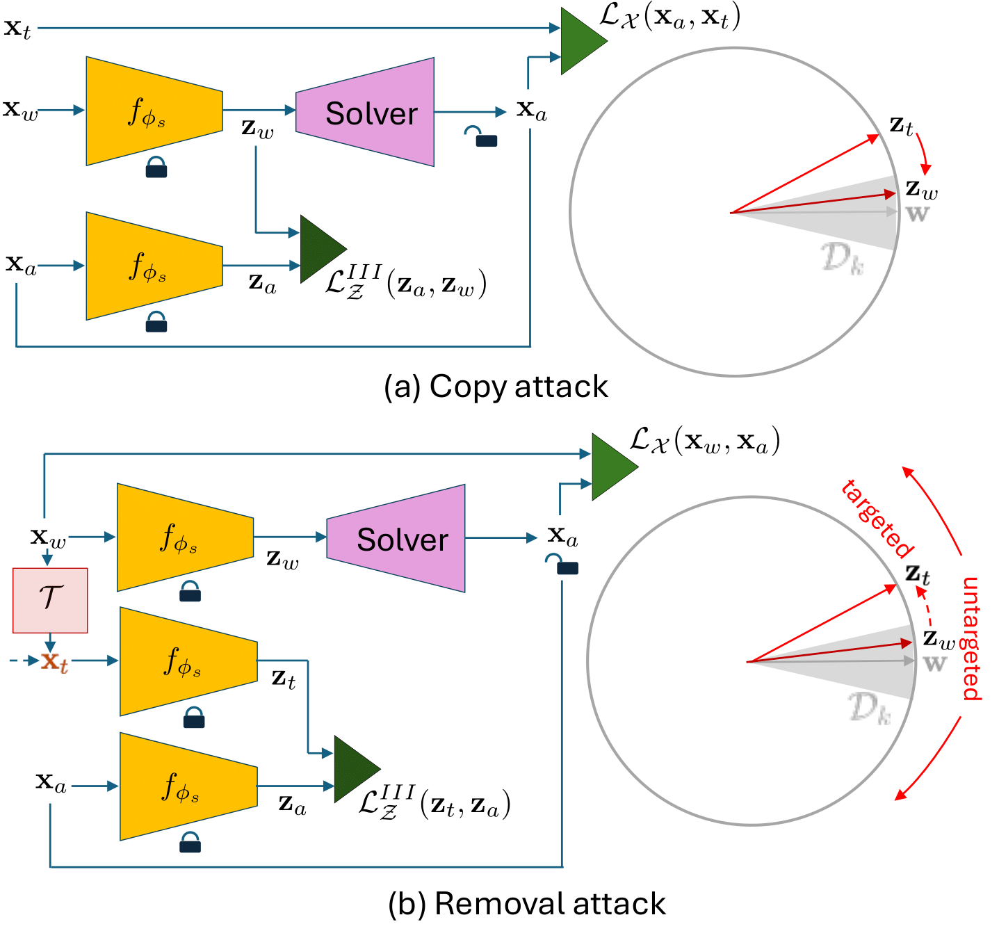

# Evaluation of Security of ML-based Watermarking: Copy and Removal Attacks

This repository contains the official implementation of the paper [**Evaluation of Security of ML-based Watermarking: Copy and Removal Attacks**]().

# Abstract



The vast amounts of digital content captured from the real world or AI-generated media necessitate methods for copyright protection, traceability, or data provenance verification. Digital watermarking serves as a crucial approach to address these challenges. Its evolution spans three generations: handcrafted methods, autoencoder-based schemes, and methods based on foundation models. While the robustness of these systems is well-documented, the security against adversarial attacks remains underexplored. This paper evaluates the security of foundation models' latent space digital watermarking systems that utilize adversarial embedding techniques. A series of experiments investigate the security dimensions under copy and removal attacks, providing empirical insights into these systems' vulnerabilities.

# Environment Setup

This project uses **Conda** for environment management. Follow the steps below to set up the necessary environment.

## Prerequisites

- [Conda](https://docs.conda.io/en/latest/miniconda.html) installed on your system.

## Steps

1. **Clone the Repository**

```bash
git clone https://github.com/vkinakh/ssl-watermarking-attacks.git
cd ssl-watermarking-attacks
```

2. Update submodules

```bash
git submodule update --init --recursive
```

3. **Create a Conda Environment**
```bash
conda env create -f environment.yml
```

5. **Activate the Environment**
```bash
conda activate ssl-watermarking-attacks
```

6. **Download Model and Normlayer **

Download model and normlayer, used in experiments
- Model: [ResNet-50 trained with DINO](https://dl.fbaipublicfiles.com/ssl_watermarking/dino_r50_plus.pth)
- Normalization layer [whitening](https://dl.fbaipublicfiles.com/ssl_watermarking/out2048_yfcc_orig.pth)

# Attacks

## Copy attack

The objective of a _copy attack_ is to maximize the probability of falsely accepting a non-watermarked image as a watermarked one.
Given a watermarked image $\mathbf{x}_w$ and a target image $\mathbf{x}_t$, the attack seeks to transfer the watermark 
from $\mathbf{x}_w$ to $\mathbf{x}_t$ without knowledge of the message $m$ or the key $k$. 

It is done by estimating the embedding $\mathbf{z}_w$ of the watermarked image $\mathbf{x}_w$ and using it as a carrier 
for watermarking a target $\mathbf{x}_t$ image.

### 0-bit

Run 0-bit copy attack:

```bash
python run_attacks.py \
       --attack=copy_0bit \
       --model=<MODEL NAME> \                         # currently supports resnet50
       --path_backbone=/PATH/TO/BACKBONE \            # currently supports DINO resnet50
       --path_norm_layer=/PATH/TO/NORMLAYER \ 
       --path_images=/PATH/TO/DIRECTORY/WITH/IMAGES \
       --transform=none \                             # supports all, none
       --psnr_wm=42 \                                 # 42 is default
       --psnr_attack=42 \                             # 42 is default
       --lambda_w=50000 \                             # 50000 is default for 0-bit copy attack
       --lambda_i=1 \                                 # 1 is default for all attacks 
       --epochs=100 \                                 # 100 is default, 25 might be enough
       --target_fpr=1e-6 \                            # 1e-6 is default, method was tested with 1e-7, 1e-8 as well
       --path_outputs=/PATH/TO/OUTPUT.csv \           # output dataframe with results, should be csv file
       --use_cosine_sim                               # copy attack works the best with cosine similarity loss
```

### Multibit

Run multibit copy attack:
```bash
python run_attacks.py \
       --attack=copy_multibit \
       --model=<MODEL NAME> \                         # currently supports resnet50
       --path_backbone=/PATH/TO/BACKBONE \            # currently supports DINO resnet50
       --path_norm_layer=/PATH/TO/NORMLAYER \ 
       --path_images=/PATH/TO/DIRECTORY/WITH/IMAGES \
       --transform=none \                             # supports all, none
       --psnr_wm=42 \                                 # 42 is default
       --psnr_attack=42 \                             # 42 is default
       --lambda_w=50000 \                             # 50000 is default for all multibit attacks
       --lambda_i=1 \                                 # 1 is default for all attacks 
       --epochs=100 \                                 # 100 is default
       --num_bits=30 \                                # method was tested with 10, 30 and 100 bits
       --path_outputs=/PATH/TO/OUTPUT.csv \           # output dataframe with results, should be csv file
       --use_cosine_sim                               # copy attack works the best with cosine similarity loss
```

## Removal attacks

The watermark removal damages the watermarked image to maximize the probability of miss detection (zero-bit watermarking),
or the bit error rate (BER) (multi-bit watermarking).

## Targeted

The targeted removal attack generates an attacked image $\mathbf{x}_a$ that is perceptually close to the watermarked 
image $\mathbf{x}_w$ while its latent representation $\mathbf{z}_a$ gets away from $\mathbf{w}$ and instead aligns with 
the latent representation of a target image $\mathbf{z}_t$.

The target selection during the removal attack plays an important role for the success of the considered removal attack.  
Three strategies are being considered. 
1) Choosing any random non-watermarked image ${\bf x}_t$. 
2) Setting target to be a heavily degraded version of ${\bf x}_w$ where the watermark is no longer detected.
3) Selecting random watermarking carrier as the new target.

## Random non-watermarked image

### 0-bit

Run 0-bit random non-watermarked image removal attack:

```bash
python run_attacks.py \
       --attack=remove_other_0bit \
       --model=<MODEL NAME> \                         # currently supports resnet50
       --path_backbone=/PATH/TO/BACKBONE \            # currently supports DINO resnet50
       --path_norm_layer=/PATH/TO/NORMLAYER \ 
       --path_images=/PATH/TO/DIRECTORY/WITH/IMAGES \
       --transform=none \                             # supports all, none
       --psnr_wm=42 \                                 # 42 is default
       --psnr_attack=42 \                             # 42 is default
       --lambda_w=1 \                                 # 1 is default, values between 1 and 50000 give decent results
       --lambda_i=1 \                                 # 1 is default for all attacks 
       --epochs=100 \                                 # 100 is default
       --target_fpr=1e-6 \                            # 1e-6 is default, method was tested with 1e-7, 1e-8 as well
       --path_outputs=/PATH/TO/OUTPUT.csv             # output dataframe with results, should be csv file
```

### Multibit

Run multibit random non-watermarked image removal attack:

```bash
python run_attacks.py \
       --attack=remove_other_multibit \
       --model=<MODEL NAME> \                         # currently supports resnet50
       --path_backbone=/PATH/TO/BACKBONE \            # currently supports DINO resnet50
       --path_norm_layer=/PATH/TO/NORMLAYER \ 
       --path_images=/PATH/TO/DIRECTORY/WITH/IMAGES \
       --transform=none \                             # supports all, none
       --psnr_wm=42 \                                 # 42 is default
       --psnr_attack=42 \                             # 42 is default
       --lambda_w=50000 \                             # 50000 is default for all multibit attacks
       --lambda_i=1 \                                 # 1 is default for all attacks 
       --epochs=100 \                                 # 100 is default
       --num_bits=30 \                                # method was tested with 10, 30 and 100 bits
       --path_outputs=/PATH/TO/OUTPUT.csv           # output dataframe with results, should be csv file
```

## Heavily degraded version of ${\bf x}_w$

Wiener filter with kernel size 25 $\times$ 25 is used as degradation. Method can be adapted to use JPEG, blurring or 
other degradation techniques.

### 0-bit

Run 0-bit heavily degraded version of watermarked image removal attack:

```bash
python run_attacks.py \
       --attack=remove_denoise_0bit \
       --model=<MODEL NAME> \                         # currently supports resnet50
       --path_backbone=/PATH/TO/BACKBONE \            # currently supports DINO resnet50
       --path_norm_layer=/PATH/TO/NORMLAYER \ 
       --path_images=/PATH/TO/DIRECTORY/WITH/IMAGES \
       --transform=none \                             # supports all, none
       --psnr_wm=42 \                                 # 42 is default
       --psnr_attack=42 \                             # 42 is default
       --lambda_w=50000 \                             # 50000 is default, values between 1 and 50000 give decent results
       --lambda_i=1 \                                 # 1 is default for all attacks 
       --epochs=100 \                                 # 100 is default
       --target_fpr=1e-6 \                            # 1e-6 is default, method was tested with 1e-7, 1e-8 as well
       --path_outputs=/PATH/TO/OUTPUT.csv \           # output dataframe with results, should be csv file
       --wiener_filter_size=25                        # 25 is default wiener filter size, bigger filter distorts image more
```

### Multibit

Run 0-bit heavily degraded version of watermarked image removal attack.:

```bash
python run_attacks.py \
       --attack=remove_denoise_multibit \
       --model=<MODEL NAME> \                         # currently supports resnet50
       --path_backbone=/PATH/TO/BACKBONE \            # currently supports DINO resnet50
       --path_norm_layer=/PATH/TO/NORMLAYER \ 
       --path_images=/PATH/TO/DIRECTORY/WITH/IMAGES \
       --transform=none \                             # supports all, none
       --psnr_wm=42 \                                 # 42 is default
       --psnr_attack=42 \                             # 42 is default
       --lambda_w=50000 \                             # 50000 is default for all multibit attacks
       --lambda_i=1 \                                 # 1 is default for all attacks 
       --epochs=100 \                                 # 100 is default
       --num_bits=30 \                                # method was tested with 10, 30 and 100 bits
       --path_outputs=/PATH/TO/OUTPUT.csv \           # output dataframe with results, should be csv file
       --wiener_filter_size=25                        # 25 is default wiener filter size, bigger filter distorts image more
```

## Random watermarking carrier

### 0-bit

Run 0-bit random watermarking carrier removal attack:

```bash
python run_attacks.py \
       --attack=remove_random_0bit \
       --model=<MODEL NAME> \                         # currently supports resnet50
       --path_backbone=/PATH/TO/BACKBONE \            # currently supports DINO resnet50
       --path_norm_layer=/PATH/TO/NORMLAYER \ 
       --path_images=/PATH/TO/DIRECTORY/WITH/IMAGES \
       --transform=none \                             # supports all, none
       --psnr_wm=42 \                                 # 42 is default
       --psnr_attack=42 \                             # 42 is default
       --lambda_w=50000 \                             # 50000 is default, values between 1 and 50000 give decent results
       --lambda_i=1 \                                 # 1 is default for all attacks 
       --epochs=100 \                                 # 100 is default
       --target_fpr=1e-6 \                            # 1e-6 is default, method was tested with 1e-7, 1e-8 as well
       --path_outputs=/PATH/TO/OUTPUT.csv \           # output dataframe with results, should be csv file
       --use_cosine_sim                               # works the best with cosine similarity
```

### Multibit

Run multibit random watermarking carrier removal attack:

```bash
python run_attacks.py \
       --attack=remove_random_multibit \
       --model=<MODEL NAME> \                         # currently supports resnet50
       --path_backbone=/PATH/TO/BACKBONE \            # currently supports DINO resnet50
       --path_norm_layer=/PATH/TO/NORMLAYER \ 
       --path_images=/PATH/TO/DIRECTORY/WITH/IMAGES \
       --transform=none \                             # supports all, none
       --psnr_wm=42 \                                 # 42 is default
       --psnr_attack=42 \                             # 42 is default
       --lambda_w=50000 \                             # 50000 is default for all multibit attacks
       --lambda_i=1 \                                 # 1 is default for all attacks 
       --epochs=100 \                                 # 100 is default
       --num_bits=30 \                                # method was tested with 10, 30 and 100 bits
       --path_outputs=/PATH/TO/OUTPUT.csv             # output dataframe with results, should be csv file
```

## Untrageted

### 0-bit

Run 0-bit untargeted removal attack:

```bash
python run_attacks.py \
       --attack=untargeted_remove_0bit \
       --model=<MODEL NAME> \                         # currently supports resnet50
       --path_backbone=/PATH/TO/BACKBONE \            # currently supports DINO resnet50
       --path_norm_layer=/PATH/TO/NORMLAYER \ 
       --path_images=/PATH/TO/DIRECTORY/WITH/IMAGES \
       --transform=none \                             # supports all, none
       --psnr_wm=42 \                                 # 42 is default
       --psnr_attack=42 \                             # 42 is default
       --lambda_w=50000 \                             # 50000 works the best
       --lambda_i=1 \                                 # 1 is default for all attacks 
       --epochs=100 \                                 # 100 is default
       --target_fpr=1e-6 \                            # 1e-6 is default, method was tested with 1e-7, 1e-8 as well
       --path_outputs=/PATH/TO/OUTPUT.csv             # output dataframe with results, should be csv file
```

### Multibit

Run multibit untargeted removal attack:

```bash
python run_attacks.py \
       --attack=untargeted_remove_multibit \
       --model=<MODEL NAME> \                         # currently supports resnet50
       --path_backbone=/PATH/TO/BACKBONE \            # currently supports DINO resnet50
       --path_norm_layer=/PATH/TO/NORMLAYER \ 
       --path_images=/PATH/TO/DIRECTORY/WITH/IMAGES \
       --transform=none \                             # supports all, none
       --psnr_wm=42 \                                 # 42 is default
       --psnr_attack=42 \                             # 42 is default
       --lambda_w=50000 \                             # 50000 is default for all multibit attacks
       --lambda_i=1 \                                 # 1 is default for all attacks 
       --epochs=100 \                                 # 100 is default
       --num_bits=30 \                                # method was tested with 10, 30 and 100 bits
       --path_outputs=/PATH/TO/OUTPUT.csv             # output dataframe with results, should be csv file
```

Other parameters are
```bash
--optimizer=Adam,lr=0.01  # optimizer and parameters in format "optimizer,parameters", supports optimizers from `torch.optim`, default "Adam,lr=0.01"
--scheduler=None          # scheduler and parameters in format "scheduler,parameters", supports schedulers from `torch.optim.lr_scheduler`, default None
--seed=42                 # seed for reproducibility
```

# Citation
```

```